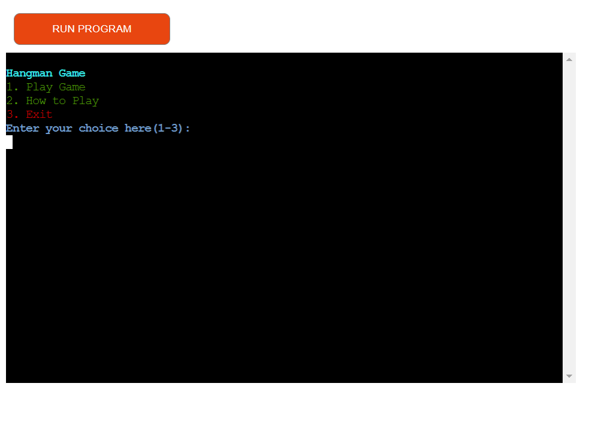
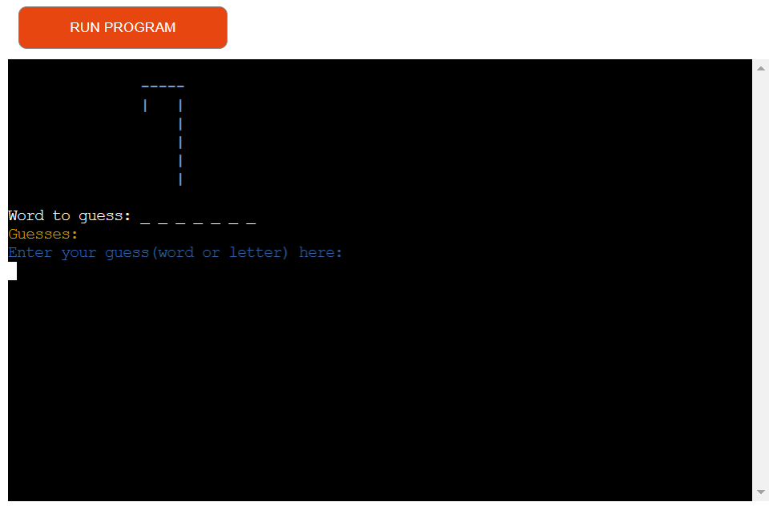
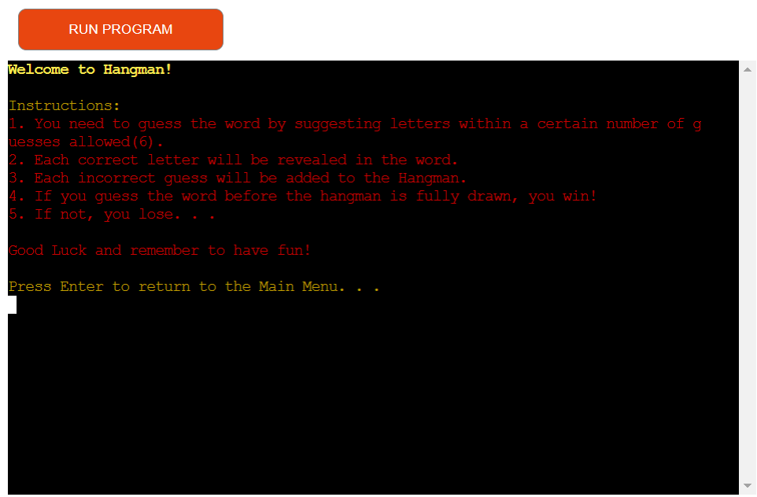
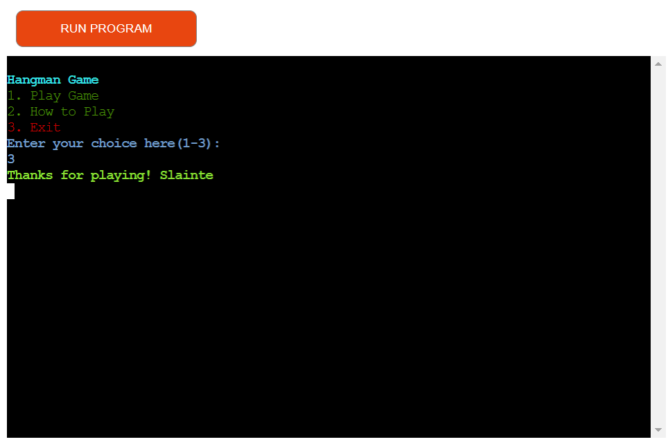
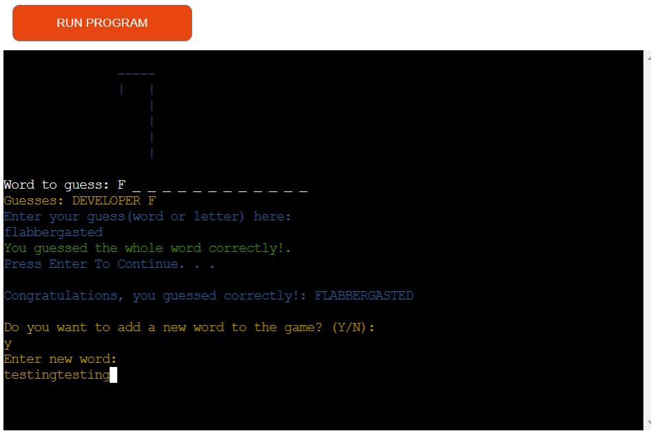

# CRAZY HANGMAN

- Crazy Hangman is a Python terminal game, which runs in the Code Institute mock terminal on Heroku.

- Players are shown a blank reprentation of the word showing the length of the word and must guess the correct word,
    by either guessing a letter or a word, before running out of lives.

  [View Live version of my project here](https://hangman--1-f2eac0d9eb69.herokuapp.com/)

  
  

## HOW TO PLAY
- First the player is greeted with a Main Menu that has 3 options, 
    1. Play Game 
    2. How to Play
    3. Exit

- If the player chooses option '1', the game will begin and the hangman will be drawn on a fresh screen.

**Play Game**
- Players are shown a blank reprentation of the word showing the length of the word and must guess the correct word,
    by either guessing a letter or a word.

- Any incorrect guesses cost the player a life, correct guesses show the chosen letters position in the word, 
    which gives insight into what the word may be.

- Players start with 6 lives.

- Each life lost adds to the hangman drawing.

- To win players must guess the word before the full hangman is drawn.

    

**Instructions**
- If the player chooses option '2', an instructions screen will show giving the player a detailed rundown of how to play.
    The player can then press Enter to continue back to the Main Menu to play the game.

    

**Exit Game**
- If the player chooses option '3', they will be thanked and the game will exit.

    

### Features

- Players are given the option to add a New Word at the end of every game with the theme of all words being a crazy animal/word/drink/hobby... Basically anything in the Crazy Theme.

    

- Players get the option to choose the full word or a letter, so if they happen to know the word they dont have to follow the original flow of the game.