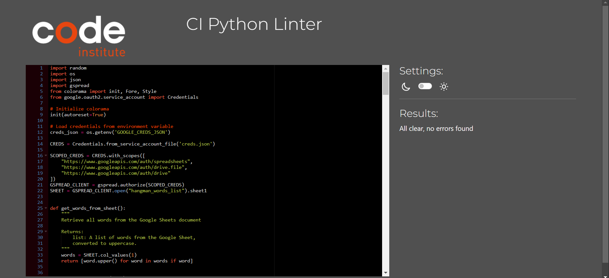

# CRAZY HANGMAN

- Crazy Hangman is a Python terminal game, which runs in the Code Institute mock terminal on Heroku.

- Players are shown a blank reprentation of the word showing the length of the word and must guess the correct word,
    by either guessing a letter or a word, before running out of lives.

  [View Live version of my project here](https://hangman--1-f2eac0d9eb69.herokuapp.com/)

  
  

## HOW TO PLAY
- First the player is greeted with a Main Menu that has 3 options, 
    1. Play Game 
    2. How to Play
    3. Exit

- If the player chooses option '1', the game will begin and the hangman will be drawn on a fresh screen.

**Play Game**
- Players are shown a blank reprentation of the word showing the length of the word and must guess the correct word,
    by either guessing a letter or a word.

- Any incorrect guesses cost the player a life, correct guesses show the chosen letters position in the word, 
    which gives insight into what the word may be.

- Players start with 6 lives.

- Each life lost adds to the hangman drawing.

- To win players must guess the word before the full hangman is drawn.

    

**Instructions**
- If the player chooses option '2', an instructions screen will show giving the player a detailed rundown of how to play.
    The player can then press Enter to continue back to the Main Menu to play the game.

    

**Exit Game**
- If the player chooses option '3', they will be thanked and the game will exit.

    

**Technologies Used**
- **Python:**The core programming language used to develop the game.
- **gspread:**A Python API for Google Sheets, used to manage the list of crazy words.
- **Google Auth:**Used to handle authentication with Google Sheets.
- **Heroku:**A cloud platform used to deploy the game and make it accessible online.
- **Colorama:**A Python package that simplifies terminal text formatting, making the games interface more visually appealing.

### Features

- **Main Menu:**
    - The main menu is the central hub of the game where players can either choose to play, view instructions or exit the game.
    - The menu is styled with colors to make it more visually appealing and easier to navigate.

- **Dynamic Word List:**
    - The game uses Google Sheets to store and manage the list of words. This allows for easy updates and expansions of the word list.
    - Players can add new words to the list at the end of each game, ensuring the game stays fresh and engaging.

- **Word Guessing Mechanics:**
    - Players can guess either individual letters or the entire word.
    - Incorrect guesses result in the hangman drawing being completed step by step, adding to the tension and excitement.
    - Correct guesses reveal the pposition of the letters within the word.

- **Hangman Drawing:**
    - The game visually represents the players progress with a hangman drawing that updates wiwth each incorrect guess.

- **Lives System:**
    - Players start with 6 lives. Each incorrect guess costs one life.
    - The game ends when the player either correctly guesses the word or they lose all their lives.

- **Game End Options:**

    - At the end of the game, players can choose to add a new word to the Google Sheets list, keeping the game dynamic and user-driven.

- **Instructions Screen:**
    - The instructions screen provides a detailed explaination of the game rules and how to play, ensuring the players can quickly get up to speed.

### Future Enchancements

- **Difficulty Levels:**
    - Add multiple difficulty levels with varying word length and lives.
- **Leaderboard:**
    - Implement a leaderboard that tracks players best performances and winning streaks.
- **Multi-Player Mode:**
    - Allow multiple players to take turns guessing.
- **Hints System:**
    - Add a hints system where players get a free hint and can also sacrifice a life for a hint.

### Deployment 

The game is deployed on Heroku and can be accessed via the following link:
[View Live version of my project here](https://hangman--1-f2eac0d9eb69.herokuapp.com/)

To deploy the game on Heroku:
1. Log in to Heroku https://heroku.com/
2. Create a new Heroku app. 
3. Set the buildpacks to Python and node.js in that order. 
4. Link that app to my local repository using Github.
5. Add the Heroku remote: `heroku git:remote -a hangman--1`
6. Ensure your Procfile, requirements.txt, and runtime.txt are in the root directory.
7. Click Deploy.
8. Push the code to Heroku:  `git push heroku main` 

### Testing

- **Manual Testing:**
    - I have manually tested this project by dong the following:
        - Passed the code through a PEP8 linter and confirmed there are no problems
        - Given invalid inputs to test the integrity of the code.
        - Tested in my local terminal and in Heroku Terminal.

### Bugs 
**Solved Bugs**
    - Inevitably i ran into a few errors along the way, some of tha major ones were:
        - When i first wrote the make guesses function i did not complete the while loop causing an error, i eventually found this and fixed the error
        - As i was using clear screen for the first time, i was not always sure when to call it, i had some trouble with the instructions menu clearing the screen while also showing it meaning it would only show for a second. I fixed this by deleting the loop i had in the main function that i initially was using to test as i created the code, and clearing the screen before the instructions only.
        - During deployment to Heroku Terminal i had installed Node.js before python making the file act as a node.js file with node packages not python therefore crashing the main push to Heroku. Clearing the buildpacks and re-adding in the correct order solved this issue.
    
    - There are no remaining bugs that I know of.

**Validator Testing**
- PEP8
    - no errors found:

**Credits**
- Code Institute for the deployment terminal
- W3 Schools for everythin i needed help with regarding classes, OOP, scope, tuples. https://www.w3schools.com/python/python_classes.asp
- love sandwiches walkthrough and the project scope walkthrough really helped give me an idea of what is was doing and how to figure it out, without giving away too much i had just enough to build my own code.
- Mentor Sessions and Tutor sessions , both were very helpful my mentor reakky helped me to stay focused on the most important task at the time. I was assisted at the end by a tutor because i had installed node js before python and was thankfully aided by a tutor.
- And also thank you to whoever created the Hangman Game itself.

